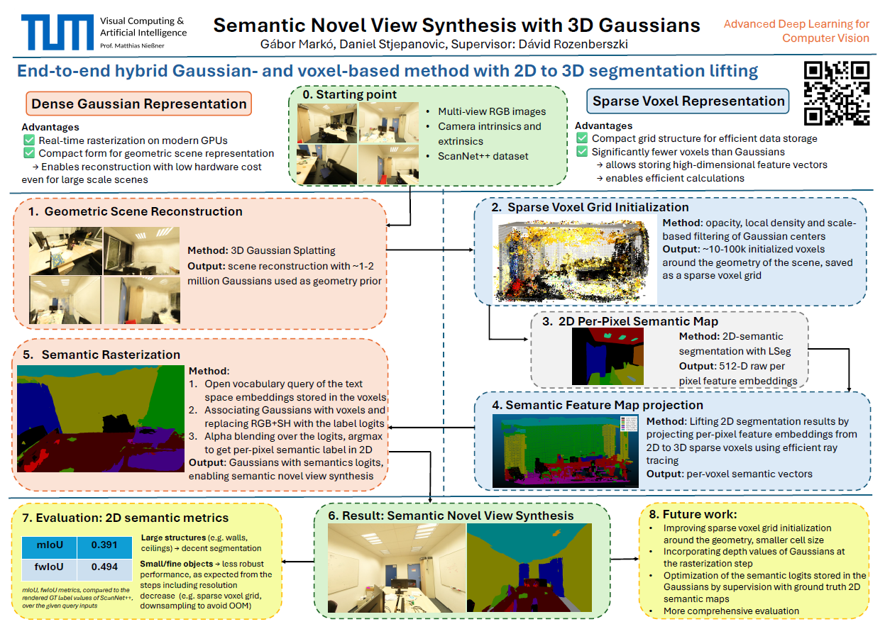
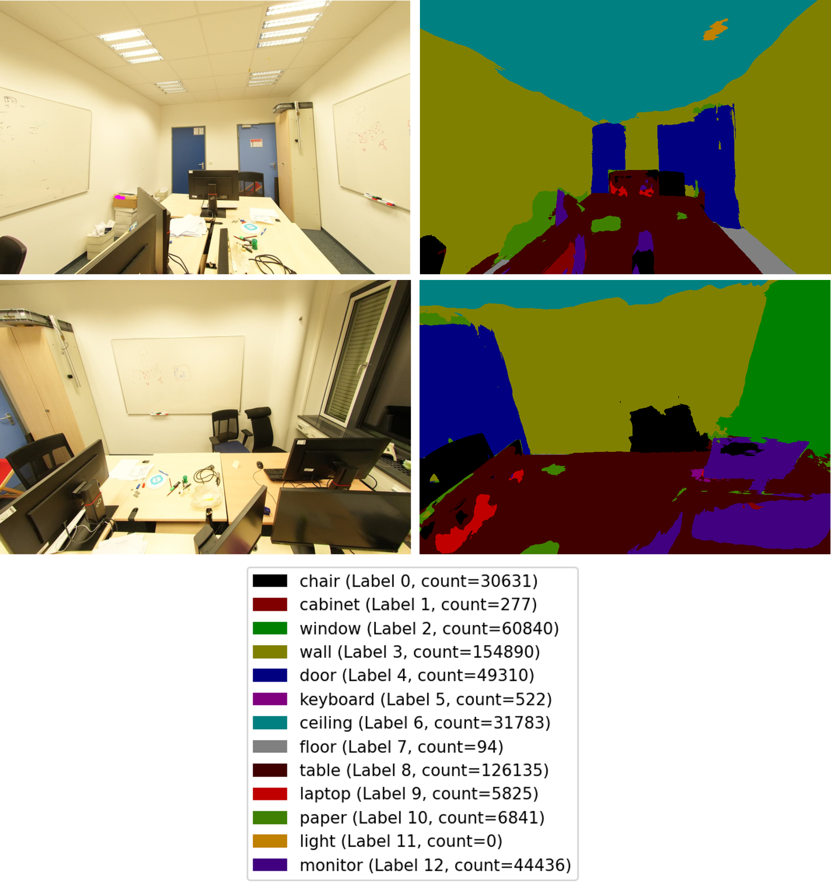

# End-to-End Pipeline for Open-Vocabulary Semantic Novel View Synthesis with 3D Gaussians
## Abstract
The task of semantic scene understanding and novel view synthesis for 3D scenes is challenging due to the limited availability of labeled 3D datasets. We propose an end-to-end pipeline that is based on two baseline methods. Firstly, we build on the Unified-Lift method, including 3D Gaussian Splatting for geometry reconstruction and 2D-to-3D lifting of semantic segmentation results. Secondly, we use the efficient voxel grid representation to store high-dimensional semantic feature vectors, as proposed in the Plenoxels method for storing the RGB and spherical harmonics values used for 3D scene reconstruction. 

By combining the advantages of these baseline methods and representation forms, we can realize open-vocabulary semantic novel view synthesis. It is achieved by rasterizing Gaussians containing logits queried from high-dimensional feature embedding vectors, which are obtained by efficiently lifting 2D segmentation results first into the sparse voxel space, and then to the Gaussian representation.

We test the performance of our method on the real-world ScanNet++ dataset to examine its robustness and evaluate the functionality of our proposed pipeline.

## Project Poster


# Project Description
## Setup
Used conda environments:
<!-- - `unified_lift_cuda121` – setup based on [Unified-Lift Usage.md](https://github.com/Runsong123/Unified-Lift/blob/main/doc/Usage.md)  -->
- `gs-env` – setup based on [3D Gaussian Splatting Installation](https://github.com/graphdeco-inria/gaussian-splatting?tab=readme-ov-file#setup)
- `minkowski_cuda110` – setup based on [MinkowskiEngine Installation](https://github.com/NVIDIA/MinkowskiEngine/) – not well supported for CUDA 12.X  
- `lang-seg` – setup based on [Lang-Seg Installation](https://github.com/isl-org/lang-seg?tab=readme-ov-file#installation)  
- `cuda` – setup based on [3D Semantic Segmentation CUDA Requirements](https://github.com/gabormarko/3D-semantic-segmentation/blob/main/cuda_requirement.txt)  

## Pipeline
**1. Geometric scene reconstruction** - based on [3D Gaussian Splatting](https://github.com/graphdeco-inria/gaussian-splatting)
- conda environment: `gs-env`
- **input:** COLMAP or NeRF Synthetic dataset, containing multi-view RGB images, and camera intrincics, extrinsics parameters
- **output:** dense Gaussian scene reconstruction, checkpoint files including all the properties of the Gaussians are saved out as '.ply' files
- **parameters:** iteration number, optimization parameters, densifying parameters, thresholds
- running the optimizer, creating the Gaussians:
```
python gaussian_splatting/train.py -s <path to COLMAP or NeRF Synthetic dataset>
```
- evaluation:
```
python gaussian_splatting/train.py -s <path to COLMAP or NeRF Synthetic dataset> --eval   # Train with train/test split
python gaussian_splatting/render.py -m <path to trained model>   # Generate renderings
python gaussian_splatting/metrics.py -m <path to trained model>   # Compute error metrics on renderings
```

**2. Sparse voxel grid initialization** - using the [Minkowski Engine](https://github.com/NVIDIA/MinkowskiEngine/)
- conda environment: `minkowsli_cuda110`, folder: `gaussian_splatting`
- **input:** '.ply' file containing the Gaussians
- **output:** sparse voxel grid initialized using the filtered Gaussian centers around the geometry
- **parameters:** cell size, local density filtering parameters, opacity&scale threshold, normal consistency parameters
- running the sparse voxel grid creator
```
bash script/minkowski_voxel_grid_from_ply_advanced.sh   # set input-output folder and filtering parameters
```

**3. 2D semantic feature extraction** - using [Language-driven Semantic Segmentation (LSeg)](https://github.com/isl-org/lang-seg)
- conda environment: `lang-seg`, folder:  `lang-seg`
- **input:** COLMAP or NeRF Synthetic dataset, containing multi-view RGB images, and camera intrincics, extrinsics parameters
- **output:** 512D raw per-pixel feature embeddings for every input image
- **parameters:** backbone model, resized resolution, checkpoint weights, extract/segmenatation mode
- running the LSeg embedded feature extraction:
```
# lang-seg/batch_lseg_infer.py: set checkpoint weights, backbone model, extract/segmenatation mode
bash lang-seg/run_batch_lseg_infer.sh   # set input-output folder
```

**4. Semantic feature map projection**
- conda environment: `cuda`, folder: `cuda_project_image_to_sparse_voxel`
- **input:** 512D raw per-pixel feature embeddings for every input image
- **output:** aggregated 512D raw per-voxel feature embeddings from all views
- **parameters:** camera parameters, voxel grid file, downsampling parameter
- running the feature map projection and aggregation:
```
python cuda_project_image_to_sparse_voxel/aggregate_voxel_features_onthefly.py   # set arguments within the .py file
```

**5.1. Associating feature embeddings with Gaussians, open-vocabulary query**
- conda environment: `gs-env`, folder: `voxel_to_Gaussian`
- **input:**  aggregated 512D raw per-voxel feature embeddings from all views, Gaussian representation from 1st step, LSeg text encoder model and checkpoint from 3rd step
- **output:** per-Gaussian logits: result of open-vocabulary query on the voxel space feature embeddings, associated to the Gaussians
- **parameters:** open-vocabulary query promts, 
- running the per-Gaussian logits creation:
```
bash voxel_to_gaussian/voxeltoGaussian_logits.sh
```

**5.2. Semantic rasterization** - using [GSplat rasterization function](https://docs.gsplat.studio/main/apis/rasterization.html)
- conda environment: `gs-env`, folder: `voxel_to_Gaussian`
- **input:** per-Gaussian logits, Gaussian representation from 1st step
- **output:** rasterized logits over the Gaussians, semantic segmentation map of novel view images using argmax of the alpha-blended logits, per-pixel confidence map
- **parameters:** camera parameters, voxel grid file, downsampling parameter
- running the semantic rasterization script:
```
bash voxel_to_gaussian/render_semantics_logits.sh
```

## Evaluation
- based on per-pixel ground truth labels, rendered from the available annotated 3D mesh for the ScanNet++ dataset
- mIoU and fwIoU metrics 

## Open-Vocabulary Semantic Novel View Synthesis - Qualitative results


## References
This code is based on [3D Gaussian Splatting](https://github.com/graphdeco-inria/gaussian-splatting), [LSeg](https://github.com/isl-org/lang-seg), [MinkowskiEngine](https://github.com/NVIDIA/MinkowskiEngine/), and [Unified-Lift](https://github.com/Runsong123/Unified-Lift/) codebases. We thank the authors for releasing their code. 


