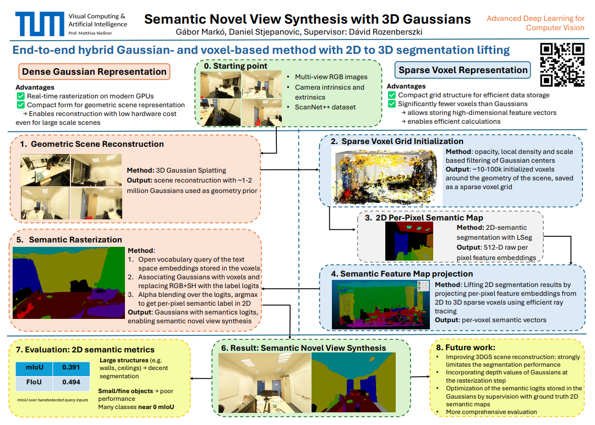

# End-to-End Pipeline for Open-Vocabulary Semantic Novel View Synthesis with 3D Gaussians
## Abstract
The task of semantic scene understanding and novel view synthesis for 3D scenes is challenging due to the limited availability of labeled 3D datasets. We propose an end-to-end pipeline that is based on two baseline methods. Firstly, we build on the Unified-Lift method, including 3D Gaussian Splatting for geometry reconstruction and 2D-to-3D lifting of semantic segmentation results. Secondly, we use the efficient voxel grid representation to store high-dimensional semantic feature vectors, as proposed in the Plenoxels method for storing the RGB and spherical harmonics values used for 3D scene reconstruction. 

By combining the advantages of these baseline methods and representation forms, we can realize open-vocabulary semantic novel view synthesis. It is achieved by rasterizing Gaussians containing logits queried from high-dimensional feature embedding vectors, which are obtained by efficiently lifting 2D segmentation results first into the sparse voxel space, and then to the Gaussian representation.

We test the performance of our method on the real-world ScanNet++ dataset to examine its robustness and evaluate the functionality of our proposed pipeline.

## Project Poster

# Project Description
## Setup
Used conda environments:
unified_lift_cuda121 - setup based on [https://github.com/Runsong123/Unified-Lift/blob/main/doc/Usage.md](https://github.com/Runsong123/Unified-Lift/blob/main/doc/Usage.md)
minkowski_cuda110 - setup based on [https://github.com/NVIDIA/MinkowskiEngine/](https://github.com/NVIDIA/MinkowskiEngine#pip) - not well supported for CUDA 12.X 
lang-seg - setup based on [https://github.com/isl-org/lang-seg?tab=readme-ov-file#installation](https://github.com/isl-org/lang-seg?tab=readme-ov-file#installation)
cuda - setup based on [https://github.com/gabormarko/3D-semantic-segmentation/blob/main/cuda_requirement.txt](https://github.com/gabormarko/3D-semantic-segmentation/blob/main/cuda_requirement.txt)
gs-env - setup based on [[https://github.com/graphdeco-inria/gaussian-splatting](https://github.com/graphdeco-inria/gaussian-splatting?tab=readme-ov-file#setup)]

## Method
1. Geometric scene reconstruction
2. Sparse voxel grid initialization
3. 2D semantic feature extraction
4. Semantic feature map projection
5. Semantic rasterization

## References
This code is based on [Gaussian Grouping](https://github.com/lkeab/gaussian-grouping), [OmniSeg3D-GS](https://github.com/OceanYing/OmniSeg3D-GS), [Panoptic-Lifting](https://github.com/nihalsid/panoptic-lifting). We thank the authors for releasing their code. 

